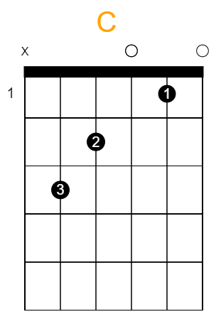

# Resolv Diagrama

Abstração para desenhar diagrama de acordes para violão ou guitarra de forma simples, intuitiva e sintética. 
A função retorna um HTML que usa a tag canvas e um código javascript com as coordenadas para desenhar o diagrama. 

Exemplo com o acorde de Dó maior (C)

~~~javascript
resolvDiagrama({
    notas: [
        { corda: 6, nulo: true },
        { corda: 5, casa: 3 , dedo: 3 },
        { corda: 4, casa: 2 , dedo: 2 },
        { corda: 3, casa: 0 },
        { corda: 2, casa: 1 , dedo: 1 },
        { corda: 1, casa: 0 },
    ],
    acordeNome: 'C',
    descForm: 'acordeC',
});
~~~

Saída:
 

## Documentação

Parâmetros          | Descrição
---------           | ------
notas: {}           | Notas que formam o acorde
acordeNome: (''/{}) | Nome do acorde
width               | Largura do diagrama	valor em px
height              | Altura do diagrama	valor em px
descForm            | Param identificador
casas               | Número de casas que vai mostrar no diagrama
cordas              | Número de cordas que possui o instrumento
margin              | Percentual que vai dar de margin
capotraste          | Representa a casa o diagrama começa

 

Para o parâmetro Notas possui as seguintes opções: 
Notas       | Descrição
---------   | ------
corda: num  | Qual corda será tocada
casa: num   | Qual casa será tocada
nulo: (0/1) | Indicar para não tocar a corda, default: false
dedo: num   | Qual dedo vai apertar a corda

 

Para o parâmetro acordeNome, caso seja objeto, possui as seguintes opções: 
Notas           | Descrição
---------       | ------
text: 'C'       | Nome do acorde
color: 'orange' | Cor do texto

## Dependências 
Nenhuma, o código é retornado em Javascript puro.
